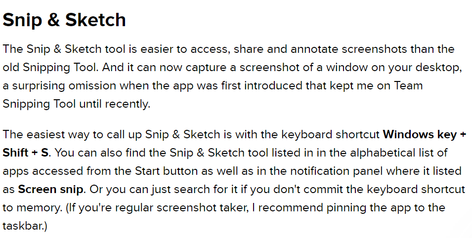

# Take Screenshot of a Selected Area in Windows

At times all you need to save is a specific area of your screen. To do this you don't have to take a screenshot of your entire screen. You can use a Snipand Sketch in Windows10.

To snip and sketch:

